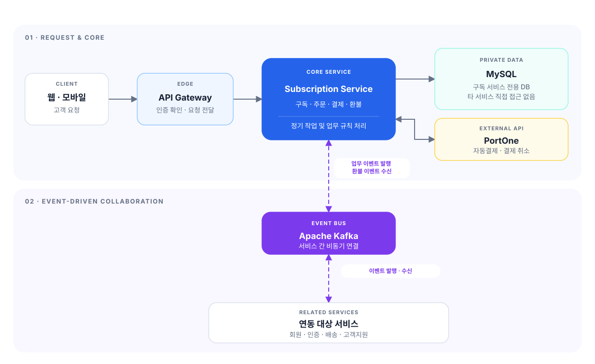

# 🍱 챱챱 구독 서비스

**챱챱**은 식사 준비와 메뉴 선택이 부담스러운 대구 지역의 1인 가구 직장인과 맞벌이 가구를 위해, 원하는 플랜과 배송 일정에 맞춰 도시락을 정기 배송하는 서비스입니다. 고객은 플랜과 배송 요일·수량·시간대·배송지를 설정하고, 예정된 식사를 월간 일정으로 확인할 수 있습니다.

이 저장소의 백엔드는 구독 신청부터 이용·갱신·해지까지의 구독 상태와 배송 조건, 결제·환불, 배송 주문 생성을 담당합니다.

---

## 서비스 및 API

| 항목 | 주소 |
| --- | --- |
| 챱챱 서비스 | [https://chapchap.meerkat.p-e.kr](https://chapchap.meerkat.p-e.kr) |
| API 문서 | [Swagger UI](https://chapchap-api.meerkat.p-e.kr/swagger-ui/index.html?urls.primaryName=subscription-service#/) |

---

## 목차

| 구분 | 본문 순서 |
| --- | --- |
| 프로젝트 정보 | [01 Subscription Service 담당자](#contributors) |
| 서비스 이해 | [02 주요 기능](#features) · [03 시스템 구성](#architecture) |
| 기술·구조 | [04 기술 스택](#tech-stack) · [05 주요 설계 고려사항](#design-considerations) · [06 백엔드 패키지 구조](#package-structure) |
| 개발·운영 | [07 로컬 실행](#local-run) · [08 테스트](#tests) · [09 배포 흐름](#deployment) |
| 참고 | [10 관련 문서](#documents) |

---

<a id="contributors"></a>

## Subscription Service 담당자

| 구분 | 내용 |
| --- | --- |
| **팀 구성** | 구독 서비스 담당 개발자 2명 |
| **공통 업무** | 구독 정책·요구사항 정리 · Backend·Client 개발 · 구독 신청·설정 변경·해지 공동 구현 |
| **이예빈** | 배송지 관리 · 이용 기간 시작 및 다음 기간 준비 · Auth Kafka 이벤트 발행 |
| **편준현** | 자동결제수단·정기결제 · 배송 주문·환불 Kafka 연동 · 구독·결제·환불 조회 API |

---

<a id="features"></a>

## 주요 기능

| 이용 단계 | 주요 기능 |
| --- | --- |
| 구독 준비 | 플랜·메뉴 조회, 필수 약관 동의, 배송지와 자동결제수단 관리 |
| 구독 신청 | 배송 요일·수량·시간대·배송지를 설정하고, 28일 배송 일정과 최종 금액을 확인한 뒤 첫 구독 신청 |
| 구독 이용 | 이용 중인 플랜과 배송 조건, 다음 배송일, 월별 주문·메뉴 조회, 구독 조건 변경과 해지 |
| 자동 운영 | 28일 단위 이용 기간 전환, 다음 배송 일정 생성, 정기결제와 결제 실패 재시도 |
| 결제·환불 | 첫 결제와 정기결제, 조건 변경에 따른 추가 결제·환불, 결제·환불 내역 조회 |
| 배송·고객지원 연동 | 배송 주문 전달, Auth Service·Customer Service 이벤트 연동, 상담용 현재 상태 조회 |

---

<a id="architecture"></a>

## 시스템 구성



| 구성 요소 | 역할 |
| --- | --- |
| Frontend·API Gateway | 고객 요청 화면 제공, 인증된 사용자 문맥과 함께 요청 전달 |
| **구독 서비스** | **구독·배송 조건·결제·환불·주문 관리와 구독 데이터 저장** |
| Auth Service | 인증과 사용자 문맥 처리, 구독·배송지 상태 이벤트 연동 |
| Delivery Service | 배송 대상 주문을 전달받아 배달 배정·진행·완료 처리 |
| Customer Service | 구독·결제·환불 관련 이벤트를 알림과 고객지원에 활용 |
| Customer-AI | 승인된 내부 API를 통해 상담 시점의 구독·결제·환불 상태를 읽기 전용으로 조회 |
| **PortOne** | **자동결제수단, 결제, 환불 연동** |

일반적인 서비스 간 상태 전달은 Kafka 이벤트로 처리하고, Customer-AI의 현재 상태 확인은 승인된 읽기 전용 내부 API로 분리합니다.

---

<a id="tech-stack"></a>

## 기술 스택

| 영역 | 기술·버전 및 적용 기준 |
| --- | --- |
| 언어 | Java 21 |
| 애플리케이션 | Spring Boot 4.1.1 · Spring Web MVC · Spring Security · Spring Data JPA · Validation |
| 데이터베이스 | MySQL 8.4.9 (개발 환경 기준) |
| 메시징 | Apache Kafka 4.3.1 (로컬 통합 테스트용 Compose 이미지) |
| 외부 API·보안 | PortOne API V2 · AES-GCM (`AES-256`) |
| API 문서 | springdoc-openapi 3.0.3 · Swagger UI |
| 빌드·테스트 | Gradle Wrapper 9.7.1 · JUnit 5 · Spring Boot Test · Spring Security Test · Spring Kafka Test · Postman |
| 컨테이너 | Eclipse Temurin (빌드: `21-jdk-jammy`, 실행: `21-jre`) |
| Infra·CI/CD | Docker · GitHub Actions · GHCR · Kubernetes · Argo CD |

Spring 모듈, MySQL Connector/J, Spring Kafka Starter는 Spring Boot 4.1.1의 의존성 관리 기준을 따릅니다. 버전은 실제 소스의 빌드 및 실행 설정을 기준으로 작성했으며, 저장소에서 버전을 고정하지 않은 도구는 버전 표기를 생략했습니다.

---

<a id="design-considerations"></a>

## 주요 설계 고려사항

| 고려사항 | 처리 방식 |
| --- | --- |
| 외부 결제 중복 방지 | 결제 요청에 멱등성 키를 사용해 동일한 요청이 중복 처리되지 않도록 관리 |
| 불명확한 결제 결과 | 새 결제를 다시 요청하지 않고 기존 결제 식별자의 결과를 조회해 상태 확인 |
| 정기결제 중복 실행 | 이용 기간 업무 키와 거래 상태를 함께 확인해 같은 기간의 결제가 중복 생성되지 않도록 처리 |
| 상태 정합성 | 구독·이용 기간·주문·결제 상태의 전이 조건을 검증하고 함께 변경되어야 하는 작업을 트랜잭션으로 처리 |
| Kafka 이벤트 신뢰성 | 배송 주문 전송 실패 대상을 재시도하고 결정적 이벤트 ID와 메시지 키·버전 검증으로 중복 및 잘못된 이벤트 처리 방지 |
| 서비스 간 상태 연동 | 일반 상태 공유는 Kafka로 처리하고, 상담 시점 조회는 승인된 읽기 전용 API로 분리 |

---

<a id="package-structure"></a>

## 백엔드 패키지 구조

```text
src/main/java/com/chapchap/subscription/
├── domain/
│   ├── address/             # 배송지
│   ├── currentstate/        # 상담 시점의 현재 상태 조회
│   ├── holiday/             # 휴일
│   ├── order/               # 주문
│   ├── payment/             # 결제·환불·결제수단
│   ├── subscription/        # 플랜·구독·배송 조건
│   └── terms/               # 약관 동의
└── global/
    ├── config/openapi/      # 공통 설정·OpenAPI
    ├── exception/           # 도메인별 예외 처리
    ├── kafka/               # 서비스 간 이벤트 연동
    ├── response/            # 공통 응답
    ├── scheduler/           # 정기 작업
    ├── security/filter/     # 인증·보안 필터
    ├── validation/          # 공통 검증
    └── verification/        # 검증 기능
```

각 도메인은 `controller`, `entity`, `repository`, `service`를 중심으로 구성하며 요청·응답 모델은 해당 도메인 안에서 관리합니다. 결제 도메인은 PortOne 연동을 위한 `client`와 빌링키 암호화를 위한 보안 패키지를 포함합니다.

---

<a id="local-run"></a>

## 로컬 실행

### 준비 사항

| 항목 | 기준 |
| --- | --- |
| JDK | 21 |
| 데이터베이스 | MySQL 8.4.9 및 로컬 데이터베이스 |
| 메시지 브로커 | Docker와 Docker Compose로 Kafka 실행 |
| 외부 결제 | 실제 결제 흐름 테스트 시 PortOne 테스트 환경 정보 |

### 1. 저장소 클론

```bash
git clone https://github.com/1-team-whyNot-chapchap/chapchap-subscription-service.git
cd chapchap-subscription-service
```

### 2. 데이터베이스 및 환경 파일 준비

MySQL에 `subscription_db`를 생성하고 `.env.example`을 `.env`로 복사합니다.

Windows PowerShell:

```powershell
Copy-Item .env.example .env
```

macOS 또는 Linux:

```bash
cp .env.example .env
```

`.env`에 데이터베이스·Kafka·PortOne 설정을 입력하고 `APP_PORT=8082`를 설정합니다. `DB_URL`은 준비한 로컬 MySQL 데이터베이스를 가리켜야 합니다.

> `.env`에는 비밀번호, 결제대행사 비밀값, 빌링키 암호화 키 등 민감한 정보가 포함될 수 있으므로 Git에 추가하지 않습니다.

### 3. Kafka 실행

```bash
docker compose -f compose.kafka.yml up -d --wait
```

### 4. 애플리케이션 실행

Windows PowerShell:

```powershell
.\gradlew.bat bootRun --args="--spring.profiles.active=local"
```

macOS 또는 Linux:

```bash
./gradlew bootRun --args='--spring.profiles.active=local'
```

### 5. 실행 확인

| 확인 항목 | 주소 |
| --- | --- |
| Swagger UI | `http://localhost:8082/swagger-ui/index.html` |
| 상태 확인 | `http://localhost:8082/actuator/health` |
| OpenAPI JSON | `http://localhost:8082/api-docs` |

---

<a id="tests"></a>

## 테스트

| 대상 | 선행 조건 | Windows | macOS / Linux |
| --- | --- | --- | --- |
| 기본 테스트 | 없음 | `.\gradlew.bat test` | `./gradlew test` |
| Kafka Broker 통합 테스트 | Kafka가 `localhost:9092`에서 실행 중 | `.\gradlew.bat kafkaIntegrationTest` | `./gradlew kafkaIntegrationTest` |

---

<a id="deployment"></a>

## 배포 흐름

1. `main` 브랜치에 변경 사항을 반영합니다.
2. GitHub Actions에서 Docker 이미지를 빌드합니다.
3. GitHub Container Registry에 이미지를 게시합니다.
4. 배포 Manifest의 이미지 태그를 갱신합니다.
5. Argo CD가 Manifest 변경을 감지해 Kubernetes 클러스터에 동기화합니다.

---

<a id="documents"></a>

## 관련 문서

| 문서 | 설명 |
| --- | --- |
| [구독 서비스 문서 모음](https://github.com/1-team-whyNot-chapchap/chapchap-docs/tree/main/Subscription-Service) | 구독 서비스의 정책·요구사항·설계 문서 |
| [구독 정책](https://github.com/1-team-whyNot-chapchap/chapchap-docs/blob/main/Subscription-Service/%EC%B1%B1%EC%B1%B1_%EA%B5%AC%EB%8F%85_%EC%A0%95%EC%B1%85.md) | 구독 운영 정책과 상태 기준 |
| [요구사항 명세서](https://github.com/1-team-whyNot-chapchap/chapchap-docs/blob/main/Subscription-Service/%EC%B1%B1%EC%B1%A1_Subscription_Service_%EC%9A%94%EA%B5%AC%EC%82%AC%ED%95%AD_%EB%AA%85%EC%84%B8%EC%84%9C.md) | 서비스 요구사항 |
| [기능 명세서](https://github.com/1-team-whyNot-chapchap/chapchap-docs/blob/main/Subscription-Service/%EC%B1%B1%EC%B1%B1_Subscription_Service_%EA%B8%B0%EB%8A%A5_%EB%AA%85%EC%84%B8%EC%84%9C.md) | 기능별 동작 기준 |
| [데이터베이스 설계 문서](https://github.com/1-team-whyNot-chapchap/chapchap-docs/blob/main/Subscription-Service/%EC%B1%B1%EC%B1%B1_Subscription_Service_DB_ERD.md) | 데이터 모델과 ERD |
| [API 명세서](https://github.com/1-team-whyNot-chapchap/chapchap-docs/blob/main/Subscription-Service/%EC%B1%B1%EC%B1%B1_Subscription_Service_API_%EB%AA%85%EC%84%B8%EC%84%9C.md) | API 계약과 요청·응답 기준 |
| [Kafka 설계서](https://github.com/1-team-whyNot-chapchap/chapchap-docs/blob/main/Subscription-Service/%EC%B1%B1%EC%B1%B1_Subscription_Service_Kafka_%EC%84%A4%EA%B3%84%EC%84%9C.md) | 이벤트와 토픽 계약 |
| [개발 환경 기준](https://github.com/1-team-whyNot-chapchap/chapchap-docs/blob/main/Subscription-Service/%EA%B5%AC%EB%8F%85_%EC%84%9C%EB%B9%84%EC%8A%A4_%EA%B0%9C%EB%B0%9C%ED%99%98%EA%B2%BD_%EA%B8%B0%EC%A4%80.md) | 개발·실행 환경 설정 |
