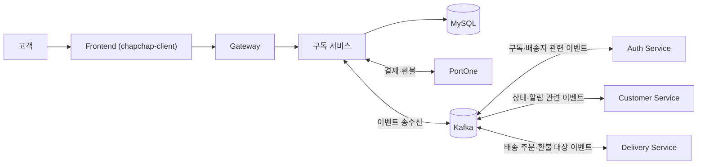
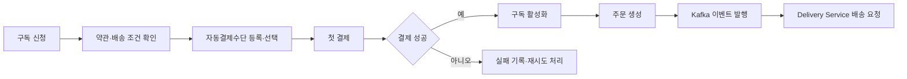
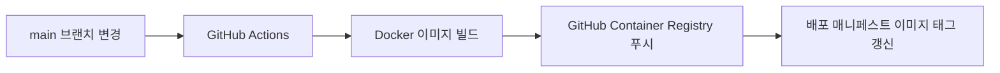

# 챱챱 - 구독 서비스

> 챱챱 도시락 정기 구독의 **구독 상태**, **배송 조건**, **결제·환불**, **주문 생성**을 담당하는 백엔드 서비스입니다.

API·데이터베이스·Kafka 계약의 상세 기준은 [구독 서비스 문서](https://github.com/1-team-whyNot-chapchap/chapchap-docs/tree/main/Subscription-Service)에서 확인할 수 있습니다.

## 서비스 한눈에 보기

| 구분 | 내용 |
| --- | --- |
| 핵심 책임 | 구독 및 배송 조건 관리, 자동결제수단 관리, 결제·환불, 주문 생성 |
| 주요 연동 | Frontend, Gateway, Auth Service, Customer Service, Delivery Service, Kafka, PortOne |
| 로컬 개발 기준 | Java 21, MySQL 8.4.9, `Asia/Seoul` |
| API 문서 | 로컬 프로필에서 Swagger UI와 OpenAPI JSON 제공 |

## 시스템 맥락



### 책임과 경계

| 영역 | 구독 서비스가 담당하는 일 | 연동 또는 제외 범위 |
| --- | --- | --- |
| 고객 요청 | Frontend가 Gateway를 통해 전달한 요청을 처리하고, Auth Service가 확인한 사용자 문맥을 사용 | 사용자 인증과 토큰 발급은 직접 처리하지 않음 |
| 구독·배송 조건 | 구독 신청·조회·변경·해지·자동 갱신, 배송지와 요일·시간대 조건 관리 | - |
| 결제·환불 | 자동결제수단 등록·검증·선택, 첫 결제·정기결제·환불 처리 | 결제대행 연동은 PortOne 사용 |
| 주문·배송 | 구독 기준 주문 생성·조회, 배송 요청 이벤트 발행 | 배달 배정·진행·완료 처리는 Delivery Service 담당 |
| 상태·알림 | 구독·결제·환불·배송지 관련 이벤트 송수신 | 실제 알림 채널 전송은 Customer Service 담당 |

## 핵심 흐름



## 기술 구성

| 구분 | 사용 기술 |
| --- | --- |
| 언어·프레임워크 | Java 21, Spring Boot 4.1.1 |
| 웹·보안 | Spring Web MVC, Spring Security, Validation |
| 데이터 | Spring Data JPA, MySQL 8.4.9 |
| 메시징 | Apache Kafka, Spring for Apache Kafka |
| API 문서 | springdoc-openapi 3.0.3 |
| 빌드·배포 | Gradle, Docker, GitHub Actions |

## 빠른 시작

### 준비 사항

| 항목 | 기준 |
| --- | --- |
| JDK | 21 |
| 데이터베이스 | MySQL 8.4.9 |
| 메시지 브로커 | Docker와 Docker Compose로 Kafka 실행 |
| 외부 결제 | PortOne 테스트 환경 정보 |

### 실행 순서

1. 환경 파일을 준비합니다.

   ```powershell
   Copy-Item .env.example .env
   ```

   `.env`에 `APP_PORT`와 데이터베이스·Kafka·PortOne 관련 값을 로컬 환경에 맞게 설정합니다.

   > `.env`에는 비밀번호, 결제대행사 비밀값, 빌링키 암호화 키 등 민감한 정보가 포함될 수 있으므로 Git에 추가하지 않습니다.

2. Kafka를 실행합니다.

   ```powershell
   docker compose -f compose.kafka.yml up -d
   ```

3. 로컬 프로필로 서비스를 실행합니다.

   ```powershell
   .\gradlew.bat bootRun --args="--spring.profiles.active=local"
   ```

   macOS 또는 Linux에서는 다음 명령을 사용합니다.

   ```bash
   ./gradlew bootRun --args='--spring.profiles.active=local'
   ```

### 로컬 API 문서

| 문서 | 주소 |
| --- | --- |
| Swagger UI | `http://localhost:<APP_PORT>/swagger-ui/index.html` |
| OpenAPI JSON | `http://localhost:<APP_PORT>/api-docs` |

## 검증

| 대상 | 선행 조건 | Windows | macOS / Linux |
| --- | --- | --- | --- |
| 기본 테스트 | 없음 | `.\gradlew.bat test` | `./gradlew test` |
| Kafka Broker 통합 테스트 | Kafka가 `localhost:9092`에서 실행 중 | `.\gradlew.bat kafkaIntegrationTest` | `./gradlew kafkaIntegrationTest` |

## 배포 흐름



## 관련 문서

| 문서 | 설명 |
| --- | --- |
| [구독 정책](https://github.com/1-team-whyNot-chapchap/chapchap-docs/blob/main/Subscription-Service/%EC%B1%B1%EC%B1%B1_%EA%B5%AC%EB%8F%85_%EC%A0%95%EC%B1%85.md) | 구독 운영 정책과 상태 기준 |
| [요구사항 명세서](https://github.com/1-team-whyNot-chapchap/chapchap-docs/blob/main/Subscription-Service/%EC%B1%B1%EC%B1%B1_Subscription_Service_%EC%9A%94%EA%B5%AC%EC%82%AC%ED%95%AD_%EB%AA%85%EC%84%B8%EC%84%9C.md) | 서비스 요구사항 |
| [기능 명세서](https://github.com/1-team-whyNot-chapchap/chapchap-docs/blob/main/Subscription-Service/%EC%B1%B1%EC%B1%B1_Subscription_Service_%EA%B8%B0%EB%8A%A5_%EB%AA%85%EC%84%B8%EC%84%9C.md) | 기능별 동작 기준 |
| [API 명세서](https://github.com/1-team-whyNot-chapchap/chapchap-docs/blob/main/Subscription-Service/%EC%B1%B1%EC%B1%B1_Subscription_Service_API_%EB%AA%85%EC%84%B8%EC%84%9C.md) | API 계약 |
| [데이터베이스 설계 문서](https://github.com/1-team-whyNot-chapchap/chapchap-docs/blob/main/Subscription-Service/%EC%B1%B1%EC%B1%B1_Subscription_Service_DB_ERD.md) | 데이터 모델과 ERD |
| [Kafka 설계서](https://github.com/1-team-whyNot-chapchap/chapchap-docs/blob/main/Subscription-Service/%EC%B1%B1%EC%B1%B1_Subscription_Service_Kafka_%EC%84%A4%EA%B3%84%EC%84%9C.md) | 이벤트와 토픽 계약 |
| [개발 환경 기준](https://github.com/1-team-whyNot-chapchap/chapchap-docs/blob/main/Subscription-Service/%EA%B5%AC%EB%8F%85_%EC%84%9C%EB%B9%84%EC%8A%A4_%EA%B0%9C%EB%B0%9C%ED%99%98%EA%B2%BD_%EA%B8%B0%EC%A4%80.md) | 개발·실행 환경 설정 |
